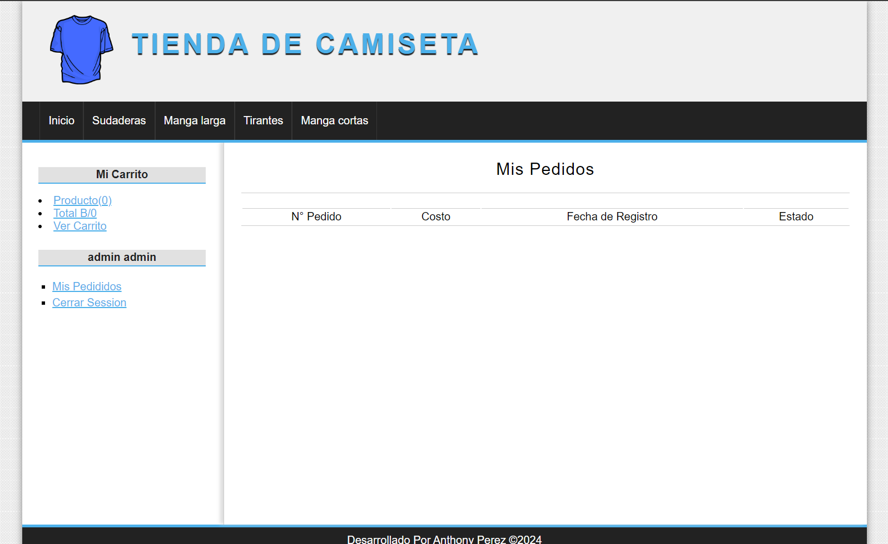

# PROYECTO TIENDA ONLINE - POO
Proyecto Personal de tienda online 

## Comenzando 🚀
Este proyecto es una aplicación web de una tienda online desarrollada en PHP utilizando el paradigma de programación orientada a objetos. La tienda ofrece funcionalidades básicas como la visualización de productos, la gestión de carrito de compras, la realización de pedidos y la administración de usuarios.


### Pre-requisitos 📋
- Servidor web (por ejemplo, Apache)
- PHP 7.x o superior
- MySQL 5.x o superior


## Configuración

1. Clona este repositorio en tu entorno local:

2. Importa la base de datos incluida en `database/database.sql` a tu sistema de gestión de bases de datos.

3. Modifica el archivo `config/database.php` con los datos de conexión a tu base de datos:

```php
define('DB_HOST', 'localhost');
define('DB_USER', 'tu_usuario');
define('DB_PASS', 'tu_contraseña');
define('DB_NAME', 'nombre_base_de_datos');
```

4. Modifica el archivo `config/parametros.php` con los datos de tu ruta del servidor
```php
define('base_url', 'url');
```


